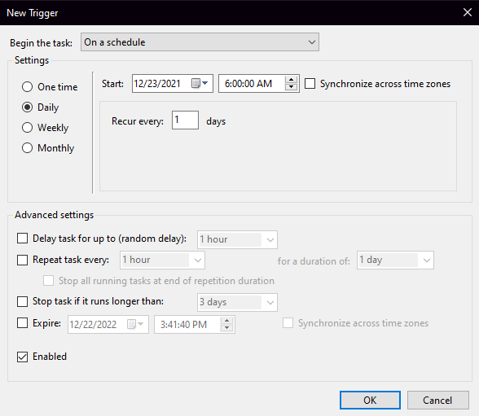
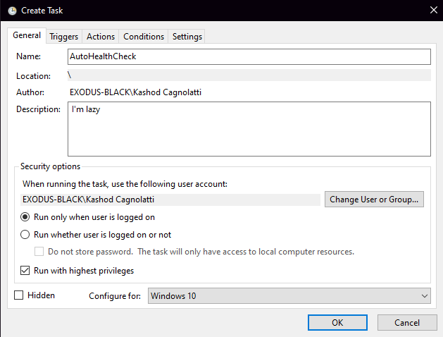
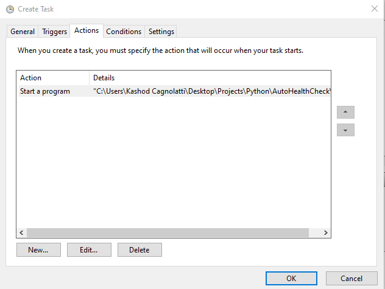
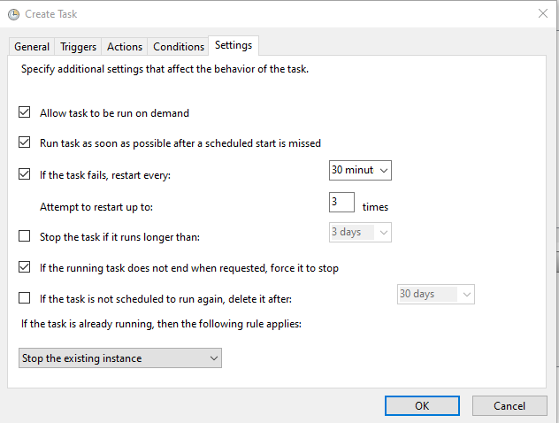

# AutoHealthCheck
Automatically fills out my daily health check form everyday at 6:00AM cuz I'm lazy.

## Project Demo
### Video Demo of Auto Health Check program
- Based on the newest update pushed to GitHub
- There is a 10 second wait between pages / to guarantee the page loads
- Removed portion of the video / Doesn't show login process (reason: shows my personal login)

Click this [link](https://drive.google.com/file/d/1McqQkN6Fxn-3s-xlloSWTLi9FNAxm2XY/view) to see the demo video\

## Current Settings with Windows Task Manager

Currently having problems using Task Manager on my PC though the script itself works. Researching universal alternatives for automation for the sake of compatibility Operating Systems.\

## Project Updates and Notes
### Update 1.0 - That's all folks
Updated the readMe with a basic rundown of the project, No using it anymore so I have no further plans to update it (,I graduated :-)).\
to whom it may concern, feel free to use the code however you want, if you find it useful. Have a good day!!

### Update 0.3 - new major update 
Updated the program to reflect the changes in the Health Check Form. Edited and added the following options to the content.py file: 
- isSick / Are you sick? (was true or false, now has 3 options) (Yes / Yes, but Cleared / No)
- isExposed / Known exposure to someone with COVID-19? (Yes / Yes, but Cleared / No)
- isPosiTest / Tested positive for COVID-19 (Yes / Yes, but Cleared / No) 

### Update 0.2 - main.py update
Updated main.py to use a spacebar input to click confirmation boxes rather than programing the mouse to move and click each box. Now the program doesn't depend on resolution size.

### Update 0.15 - Batch update
Updated the code in AutoHealthCheck.bat / More adaptable .bat use, set path to working directory is now generalized to the location of the AutoHealthCheck.bat file. file must be placed in the same folder as the working directory to function as intended.

### Update 0.1 - Base program
Created a repository for the project and added the first version. Can be ran with the AutoHealthCheck.bat file in the main folder. Currently making the program more adaptable, since it breaks under certain conditions:
- Web browser is already logged into student account
- It takes longer than brLoadTime seconds to load the page (brLoadTime is currently set to 10 seconds)

Also it currently only fills out a single set of options for healthy vaccinated users.\ 